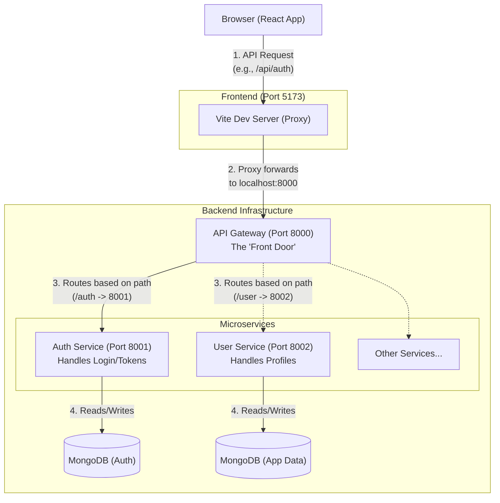

# Microservices & API Gateway Flow

This document explains the real-world architecture flow of using an API Gateway with microservices, which is a common pattern used by senior engineers for scalable applications.

## 1. The High-Level Flow (Visualized)

## 2. Why do we need this? (The "Senior Engineer" Perspective)

When you are building a small app, having one single backend (a "Monolith") is perfectly fine. But as companies and applications grow, senior engineers split the backend into **Microservices** and put an **API Gateway** in front of them for several critical reasons:

### A. The Role of the API Gateway (The "Front Door")
Instead of your React frontend having to memorize the ports and addresses of 10 different services (Auth on 8001, Users on 8002, Posts on 8003, etc.), the frontend only talks to **one single place**: the Gateway on port `8000`. 
- **Routing:** It looks at the incoming request (e.g., `/auth/google`) and routes it to the correct microservice.
- **Security & Centralization:** It can block bad requests, rate-limit spam, and verify JWT tokens in one place before the request even reaches your core services.
- **CORS:** You only need to configure CORS once on the Gateway, instead of repeating it on every single microservice.

### B. Why do the individual services need their own configurations?
Even though the Gateway is the boss that directs traffic, the individual services (like your Auth Service) are **completely independent applications**.
- **Independence:** If the Auth service crashes, the User service stays online.
- **Dedicated Databases:** Services often connect to their own databases so they don't lock each other's data and can scale independently.
- **Different Technologies:** The Auth service could be written in Node.js, while a heavy data-processing service could be written in Python. 
- **Configurations (.env):** Because they are entirely separate running processes, they need their own `.env` files to know what port they should listen on, and what database they should connect to. The Gateway doesn't do the database work; it just hands the request off.

## 3. What is happening in your code right now?
1. Your **React App** makes a request to `localhost:5173/auth/google`.
2. **Vite's Proxy** (configured in `vite.config.ts`) catches it and forwards it to your **Gateway** at `localhost:8000/auth/google`.
3. Your **Gateway** receives it, sees that the URL starts with `/auth`, and forwards it to your **Auth Service** at `localhost:8001/api/auth/google`.
4. Your **Auth Service** does the heavy lifting: talks to Google, creates the user in MongoDB, generates a JWT cookie, and sends a redirect response back through the chain so your browser goes to the dashboard.
